# Single-LED Flasher Circuit

This project demonstrates how to build a simple 555 timer circuit with one flashing LED

# Parts List

### Required Parts

| Number Required | Part Name | Notes |
| -----:| ------- | ---------- |
|  1    | 9-Volt Battery | |
|  1    | 9-Volt Battery Wiring Harness | [Amazon](https://www.amazon.com/dp/B07YBZ18VS) |
|  1    | Breadboard | [Amazon](https://www.amazon.com/dp/B07LFD4LT6) |
|  4    | ` * ` Jumper Wires | [Amazon](https://www.amazon.com/dp/B08YRGVYPV) |
|  1    | 555 Timer Chip | [Amazon](https://www.amazon.com/dp/B0CBKFMWDP) |
|  1    | 1uF Electrolytic Capacitor | [Amazon](https://www.amazon.com/dp/B0F8C4BBNT) |
|  1    | ` ** ` 100K Ohm Resistor | [Amazon](https://www.amazon.com/dp/B0B4JDHXC9) |
|  1    | ` ** ` 470K Ohm Resistor | [Amazon](https://www.amazon.com/dp/B07HDGJDVS) |
|  1    | ` ** ` 270 Ohm Resistor | [Amazon](https://www.amazon.com/dp/B07QG1VDJ9) |
|  1    | Light-Emitting Diode (LED) | [Amazon](https://www.amazon.com/dp/B0G4LV2DZ6) |

` * ` Four short jumper wires, each 2-inches or less

` ** ` Standard non-polarized resistor. That is, it dosen't matter which direction current flows through the resistor, so it won't matter how you connect it

The capacitor and LED *is* polarized, so you'll need to identify their positive (+)
and negative (-) terminal wires to ensure that current flows through them in the
correct direction. The build steps below will explain how to identify and properly
connect them in the circuit.

### Optional Parts

| Part Name | Notes |
| --------- | ----- |
| Multi-function Wire Stripping/Cutting Pliers | For trimming and stripping wires as needed ([Amazon](https://www.amazon.com/dp/B08Y6GDS61)) |

## Step 1: Breadboard Orientation

Place the breadboard on a flat surface, and orient it so that Row 1 is at the top from your point of view

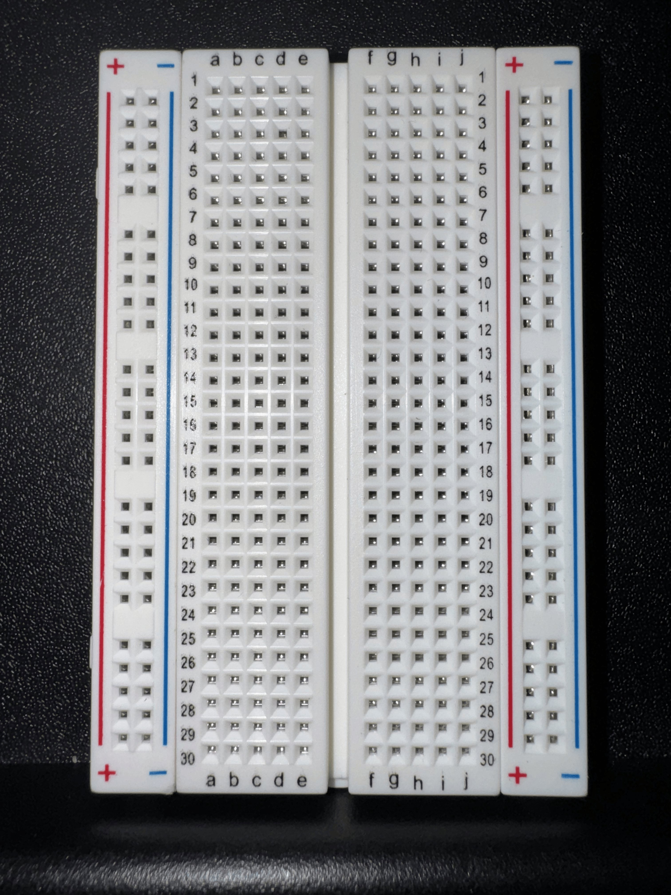
---

## Step 2: Add the 555 Chip

* Carefully insert your 555 timer chip with its half-moon notch pointing upward, toward the top of the breadboard

* The 4 pins on each side of the 555 should span the wide center channel that vertically 
  divides the left and right halves of your breadboard

* The horizontal row that you choose for inserting the 555 is up to you, but make sure
  to leave plenty of room below the 555 to expand downward with the remaining components

* Anywhere between row 5 and row 11 should be fine

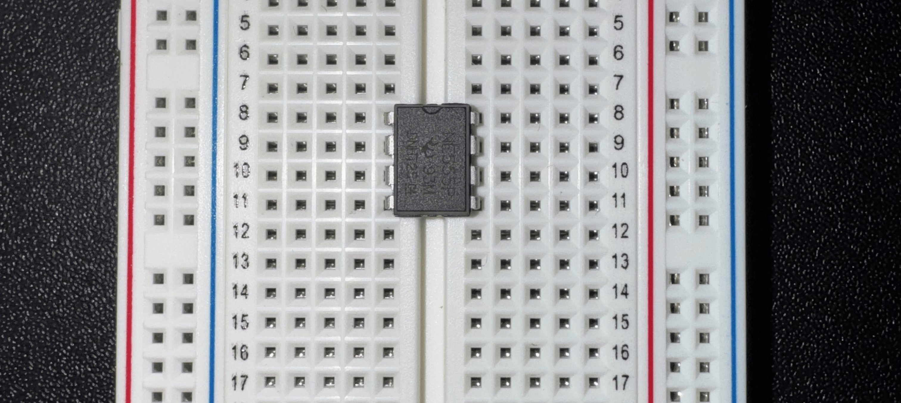
---

## Step 3: Connect 555's VCC [8] to Breadboard's Power Rail (+)

Use a short jumper wire to connect the 555's **VCC** pin **[8]** to the breadboard's red power rail **(+)**

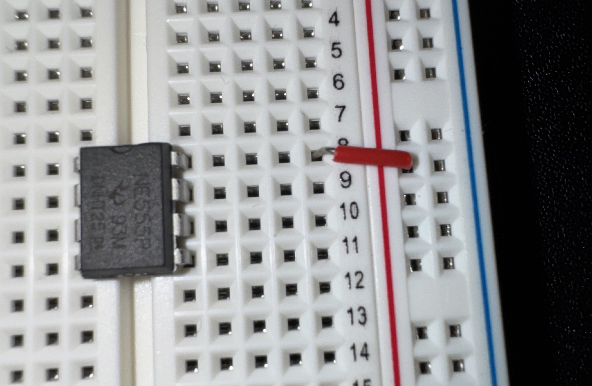
---

## Step 4: Connect 555's GND [1] to Breadboard's Ground Rail (-)

Use a short jumper wire to connect the 555's **GND** pin **[1]** to the breadboard's blue ground rail **(-)**

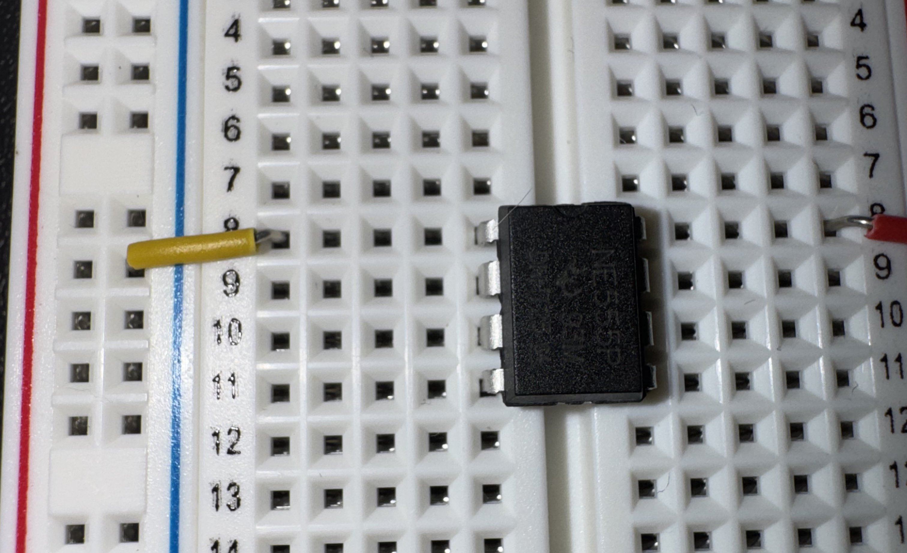
---

## Step 5: Connect 555's TRIGGER [2] and THRESHOLD [6] pins

Use a medium jumper wire to connect the 555's **TRIGGER** pin **[2]** and **THRESHOLD** pin **[6]**

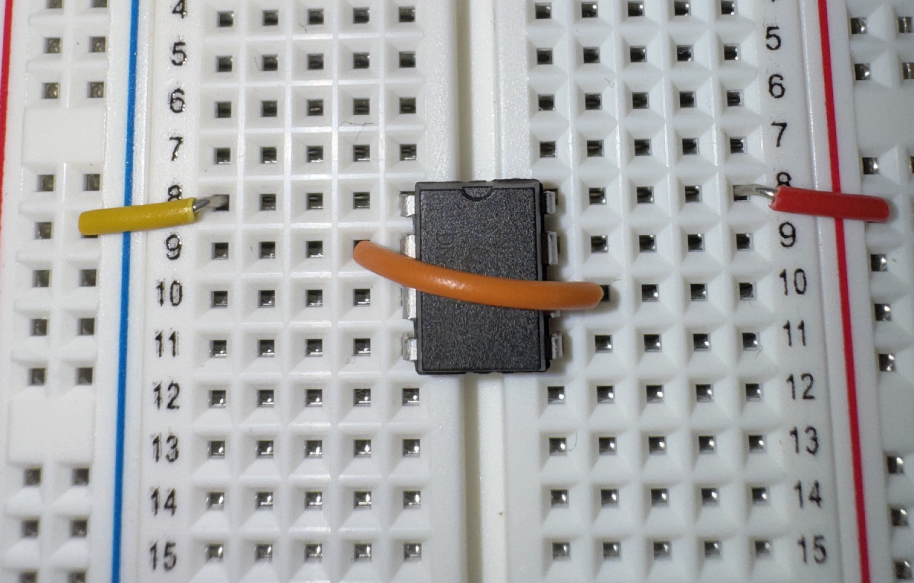
---

## Step 6: Connect 555's RESET [4] and VCC [8] pins

Use another medium jumper wire to connect the 555's **RESET** pin **[4]** and **VCC** pin **[8]**

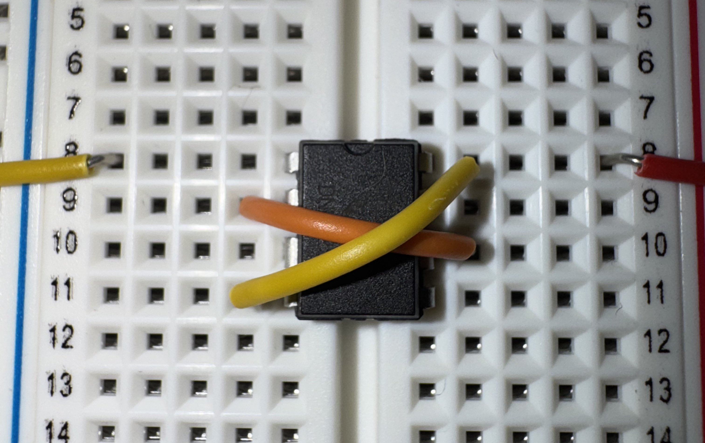
---

## Step 7: Connect 1uF Capacitor to 555's TRIGGER [2] and Ground Rail (-)

* Connect the capacitor's positive pole (long leg, "anode") to the 555's **TRIGGER** pin **[2]**
   
* Connect the capacitor's negative pole (short leg, "cathode") to the left side ground rail **(-)**

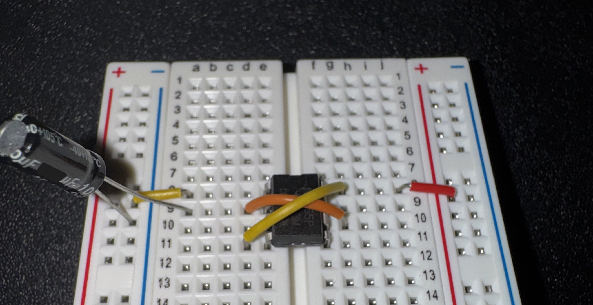
---

## Step 8: Connect 100K Ohm Resistor to 555's DISCHARGE [7] and Power Rail (+)

* Connect one end of the 100K ohm resistor to the 555's **DISCHARGE** pin **[7]**

* Connect the other end to the breadboard's right side power rail **(+)**

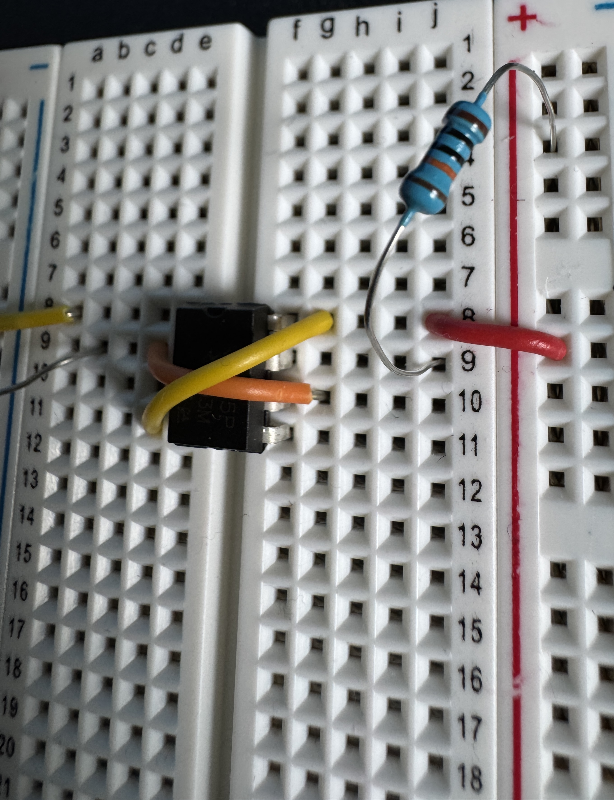
---

## Step 9: Connect 470K Ohm Resistor to 555's DISCHARGE [7] and THRESHOLD [6] pins

* Connect one end of the 470K ohm resistor to the 555's **DISCHARGE [7]** pin

* Connect the other end to the 555's **THRESHOLD [6]** pin 

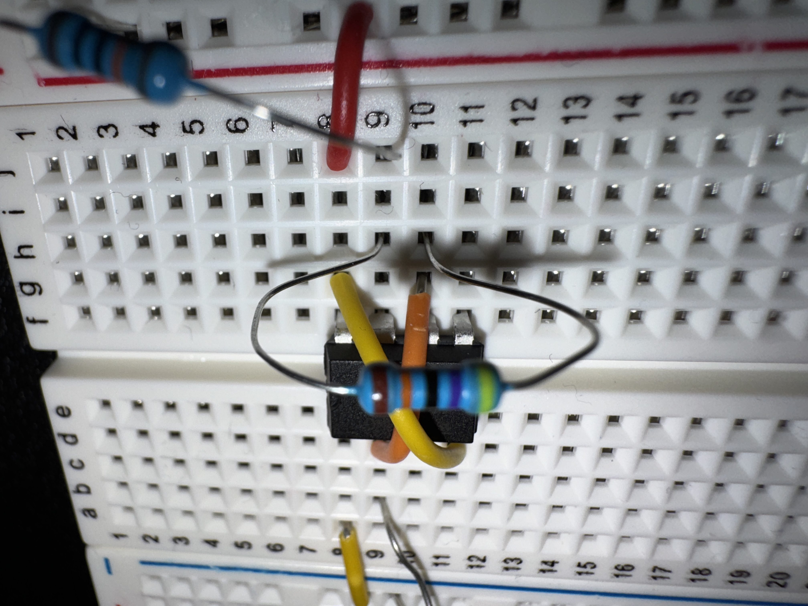
---

## Step 10: Connect the 270 Ohm Resistor to 555's OUTPUT [3]

* Connect one end of the **270 ohm resistor** to the 555's **OUTPUT** pin **[3]**

* Connect the other end to any **empty row** that is 5 or more rows below the 555 chip

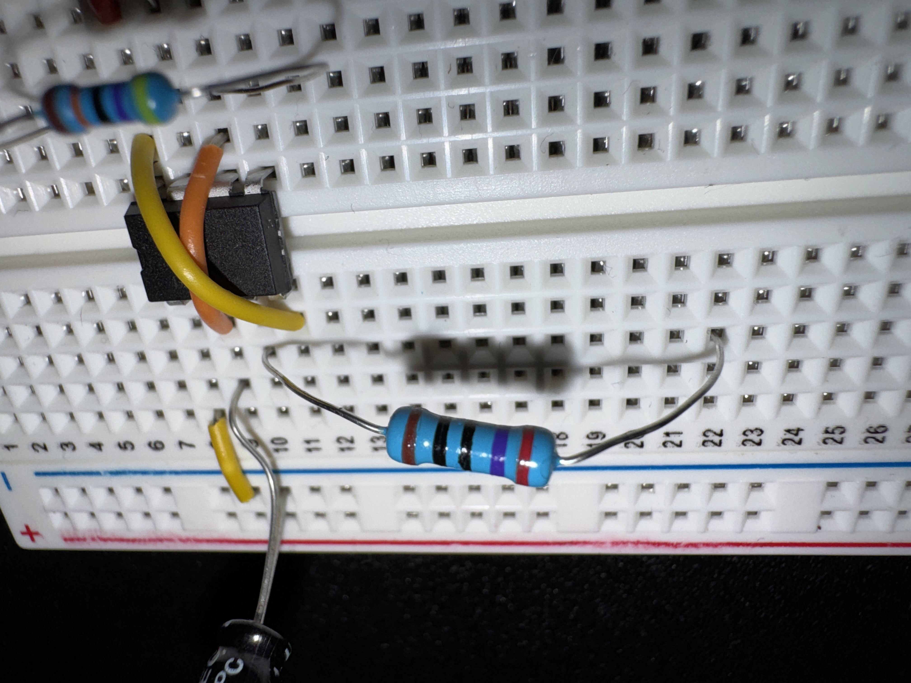
---

## Step 11: Connect LED to 270 Ohm Resistor and to Ground Rail (-)

* Connect the LED's positive, long leg (anode) to the terminating row of the 270 Ohm resistor from Step 10

* Connect the LED's negative, short leg (cathode) to the breadboard's blue ground rail **(-)**
    
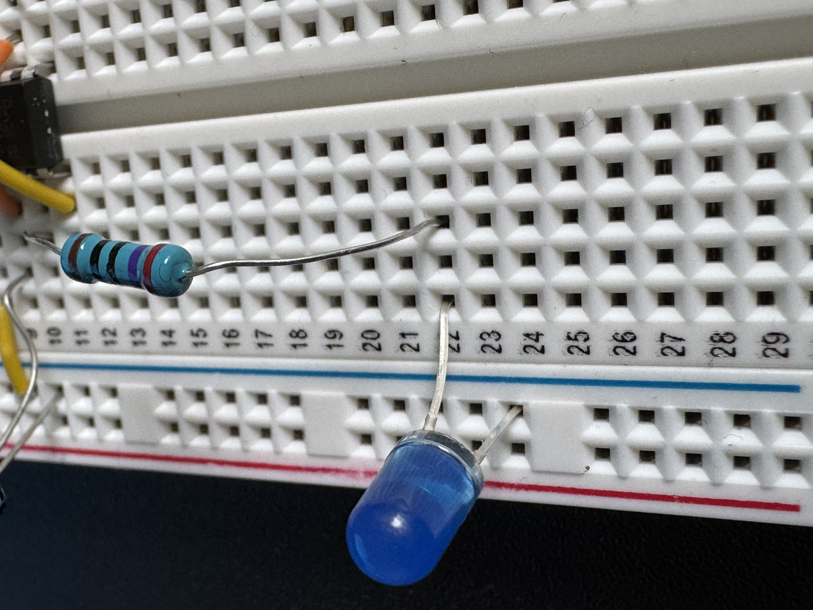
---

## Step 12: Connect 9-Volt Battery's Positive Wire to the Breadboard's Power (+) Rail

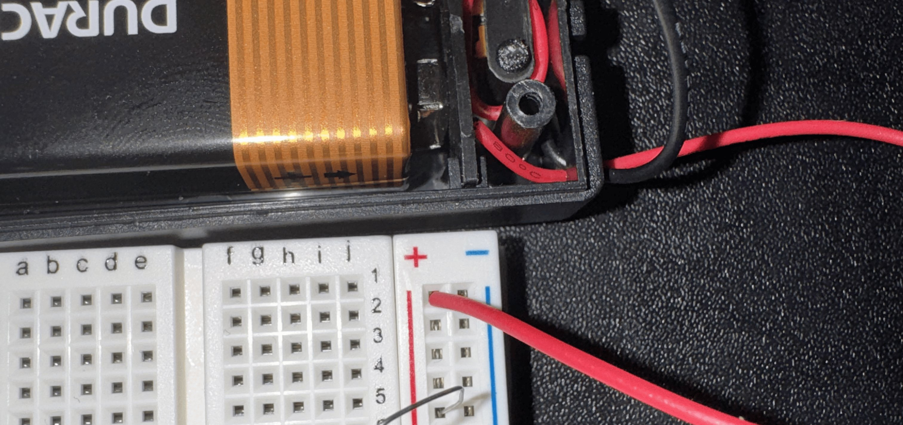
---

## Step 13: Connect 9-Volt Battery's Negative Wire to the Breadboard's Ground (-) Rail

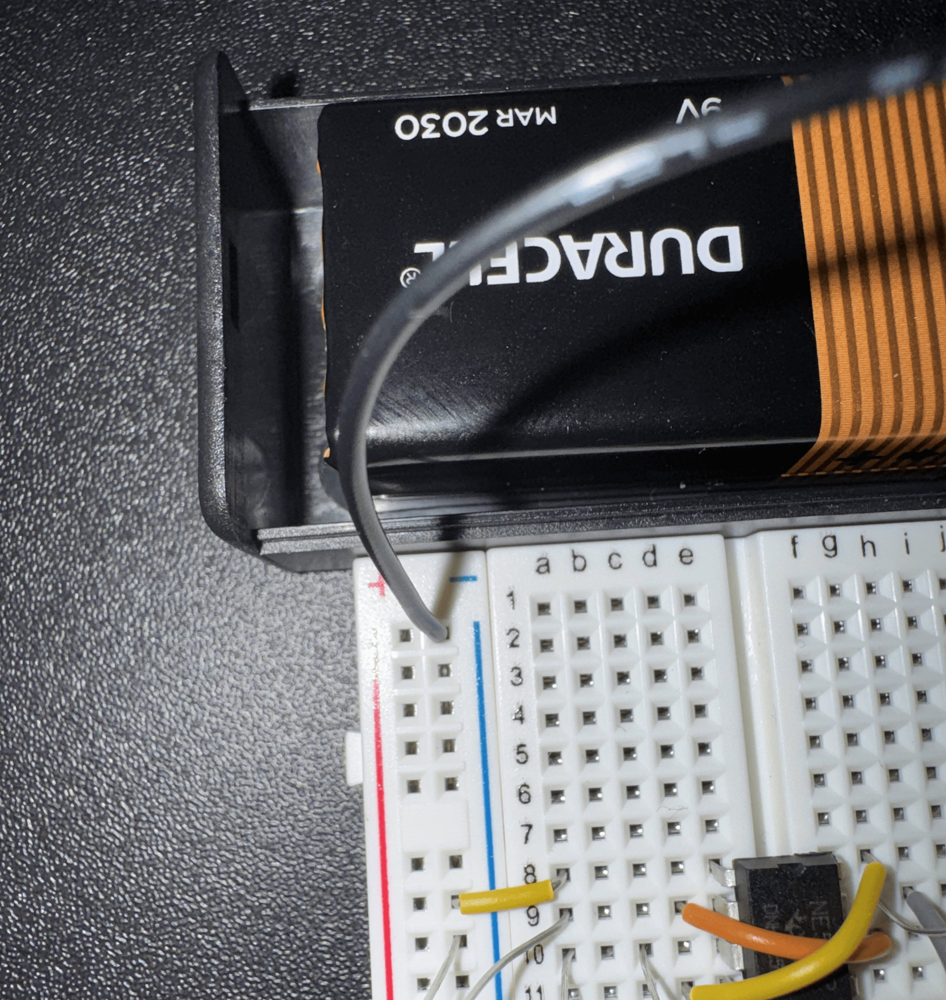
---

## The Finished Circuit!

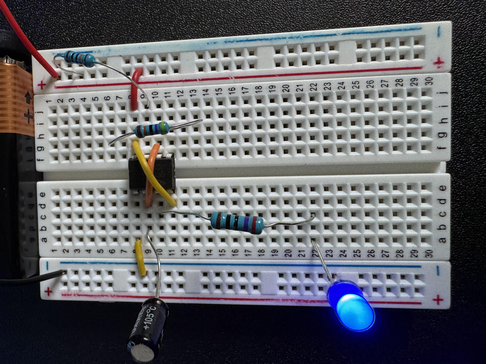

