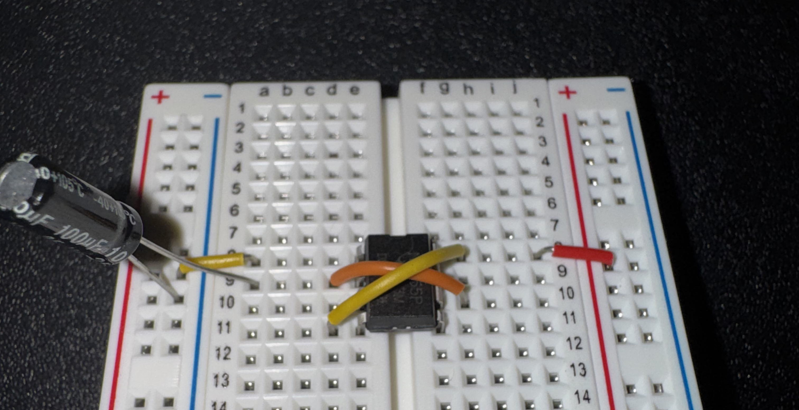

# Dual LED Flasher with Rotary Potentiometer

This project demonstrates how to build a 555 timer circuit with dual flashing LEDs and utilizing a rotary potentiomenter for modifying LED flash frequency

# Parts List

### Required Parts

| Number Required | Part Name | Notes |
| -----:| ------- | ---------- |
|  1    | 9-Volt Battery | |
|  1    | 9-Volt Battery Wiring Harness | [Amazon](https://www.amazon.com/dp/B07YBZ18VS) |
|  1    | Breadboard | [Amazon](https://www.amazon.com/dp/B07LFD4LT6) |
|  7    | ` * ` Jumper Wires | [Amazon](https://www.amazon.com/dp/B08YRGVYPV) |
|  1    | 555 Timer Chip | [Amazon](https://www.amazon.com/dp/B0CBKFMWDP) |
|  1    | 100uF Electrolytic Capacitor | [Amazon](https://www.amazon.com/dp/B0FS1KSBK5) |
|  1    | ` ** ` 1K Ohm Resistor | [Amazon](https://www.amazon.com/dp/B0FP1YFMVM) |
|  2    | ` ** ` 270 Ohm Resistor | [Amazon](https://www.amazon.com/dp/B07QG1VDJ9) |
|  2    | 1N4007 Rectifier Diode | [Amazon](https://www.amazon.com/dp/B0FC2CQF24) |
|  2    | Light-Emitting Diode (LED) | [Amazon](https://www.amazon.com/dp/B0G4LV2DZ6) |
|  1    | 10K Rotary Potentiometer | [Amazon](https://www.amazon.com/dp/B071ZVNFJ8) |

` * ` Jumper wire lengths don't need to be precise, but the following should suffice (*your mileage may vary*): **Two** 1-inch wires ("short"), **Two** 2-inch wires ("medium"), **Three** 3-inch wires ("long")

` ** ` Standard non-polarized resistor. That is, it dosen't matter which direction current flows through the resistors, so it won't matter how you connect them

The capacitor, LEDs, and rectifier diodes *are* polarized, so you'll need to identify their positive (+)
and negative (-) terminal wires, and ensure that current flows through them in the correct direction. The build
steps below will explain how to identify and properly connect them in the circuit.

### Optional Parts

| Part Name | Notes |
| --------- | ----- |
| Multi-function Wire Stripping/Cutting Pliers | For trimming and stripping wires as needed ([Amazon](https://www.amazon.com/dp/B08Y6GDS61)) |

## Step 1: Breadboard Orientation

Place the breadboard on a flat surface, and orient it so that Row 1 is at the top from your point of view

---

## Step 2: Add the 555 Chip

* Carefully insert your 555 timer chip with its half-moon notch pointing upward, toward the top of the breadboard

* The 4 pins on each side of the 555 should span the wide center channel that vertically 
  divides the left and right halves of your breadboard

* The horizontal row that you choose for inserting the 555 is up to you, but make sure
  to leave plenty of room below the 555 to expand downward with the remaining components

* Anywhere between row 5 and row 11 should be fine

---

## Step 3: Connect 555's VCC [8] to Breadboard's Power Rail (+)

Use a short jumper wire to connect the 555's **VCC** pin **[8]** to the breadboard's red power rail **(+)**

---

## Step 4: Connect 555's GND [1] to Breadboard's Ground Rail (-)

Use a short jumper wire to connect the 555's **GND** pin **[1]** to the breadboard's blue ground rail **(-)**

---

## Step 5: Connect 555's TRIGGER [2] and THRESHOLD [6] pins

Use a medium jumper wire to connect the 555's **TRIGGER** pin **[2]** and **THRESHOLD** pin **[6]**

---

## Step 6: Connect 555's RESET [4] and VCC [8] pins

Use another medium jumper wire to connect the 555's **RESET** pin **[4]** and **VCC** pin **[8]**

---

## Step 7: Connect 100uF Capacitor to 555's TRIGGER [2] and Ground Rail (-)

* Connect the capacitor's positive pole (long leg, "anode") to the 555's **TRIGGER** pin **[2]**
   
* Connect the capacitor's negative pole (short leg, "cathode") to the left side ground rail **(-)**

---

## Step 8: Connect 1K Ohm Resistor to 555's DISCHARGE [7] and Power Rail (+)

* Connect one end of the 1K ohm resistor to the 555's **DISCHARGE** pin **[7]**

* Connect the other end to the breadboard's right side power rail **(+)**

---

## Step 9: Connect the First 270 Ohm Resistor (1 of 2) to 555's OUTPUT [3]

* Connect one end of the **270 ohm resistor** to the 555's **OUTPUT** pin **[3]**

* Connect the other end to an **empty row** that is 5 or more rows below the 555 chip

---

## Step 10: Connect the First Rectifier Diode (1 of 2) to 270 Ohm Resistor #1

* Look closely at the **1N4007 rectifier diode**. Note that its negative **(-)** pole (cathode) is the one 
  with the silver stripe on the rectifier's central barrel. The other pole is positive **(+)** (anode)

* Connect the positive **(+)** pole of the rectifier to the same row as your **270 ohm resistor** terminating
  row from Step 9

* Connect the negative **(-)**, silver-striped pole to an empty row down below

---

## Step 11: Connect the First LED (1 of 2) to Rectifier Diode #1 and to Ground Rail (-)

* Connect the LED's positive, long leg (anode) to the terminating row of rectifier #1 from Step 10

* Connect the LED's negative, short leg (cathode) to the breadboard's blue ground rail **(-)**
    

---

## Step 12: Connect the Second 270 Ohm Resistor (2 of 2) to 555's OUTPUT [3]

* Similar to Step 9, connect one end of the **270 ohm resistor** to the 555's **OUTPUT** pin **[3]**

* As before, connect the other end of the resistor to an **empty row** below the 555 chip

---

## Step 13: Connect the Second Rectifier Diode (2 of 2) to 270 Ohm Resistor #2

* Similar to Step 10, we need to connect **Rectifier #2** to **270 Ohm Resistor #2**, but this time
  connect the silver-striped negative **(-)** pole of the rectifier to resistor #2's terminating row

* Connect the positive **(+)** pole of the rectifier to an empty row down below, but this time connect
  it to an empty row over on the right side of the breadboard (somewhere near the bottom), so that the
  rectifier is spanning across the the wide center channel of the breadboard       

---

## Step 14: Connect the Second LED (2 of 2) to Rectifier Diode #2 and to Power Rail (+)

* Connect the LED's negative, short leg (cathode) to the terminating row of rectifier #2 from Step 13

* Connect the LED's positive, long leg (anode) to the right side power rail **(+)**

---

## Step 15: Add Jumper Wires in Preparation for the 10K Potentiometer

* Use a long jumper wire to connect the 555's **DISCHARGE** pin **[7]** to an empty row at least
  10 rows below the 555 chip

* Use a long jumper wire to connect the 555's **THRESHOLD** pin **[6]** to an empty row that is two
  rows **ABOVE** the jumper from the previous step (closer to the 555)

* Use another long jumper wire to connect the 555's **THRESHOLD** pin **[6]** with an empty row
  that is two rows **ABOVE** the jumper from the previous step

---

## Step 16: Connect the 10K Potentiometer

* Carefully insert the three pins of the 10K potentiometer into the three terminating rows from the previous step

* The 3 long jumper wires and the 3 pins of the potentiometer should occupy the same rows, with the rotating knob of the potentiometer pointing to the right

---

## Step 17: Connect 9-Volt Battery's Positive Wire to the Breadboard's Power (+) Rail

---

## Step 17: Connect 9-Volt Battery's Negative Wire to the Breadboard's Ground (-) Rail

---

# The Finished Circuit!

