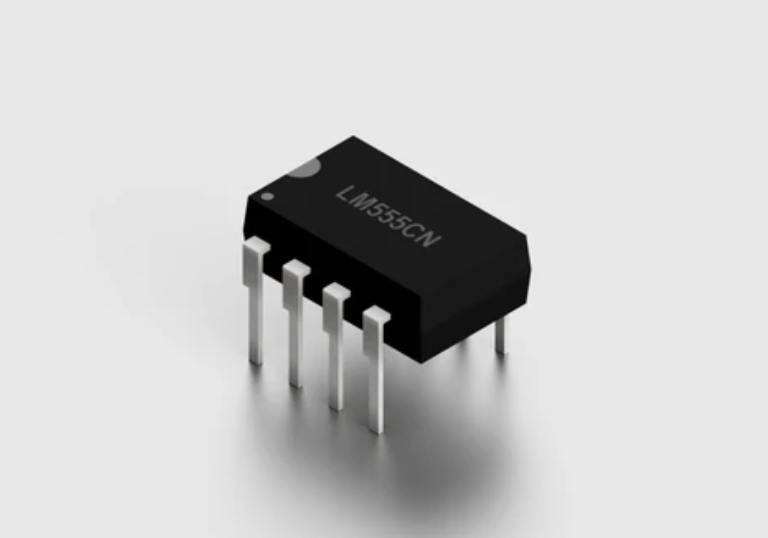
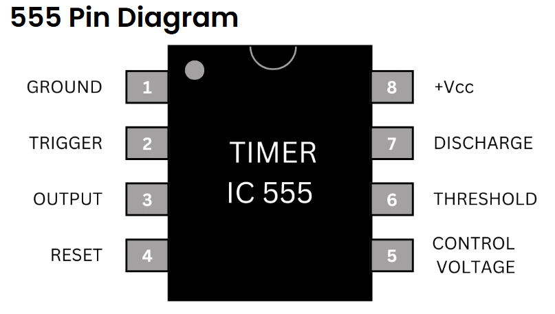
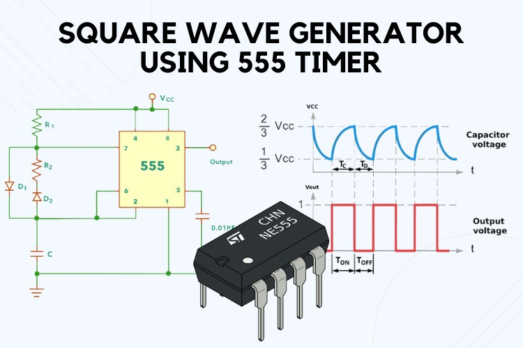

# 555 Timer Integrated Circuit (IC) Projects

Here, you'll find a few simple projects for learning about electronics, all centered around the
extremely popular 555 timer integrated circuit or "chip"

