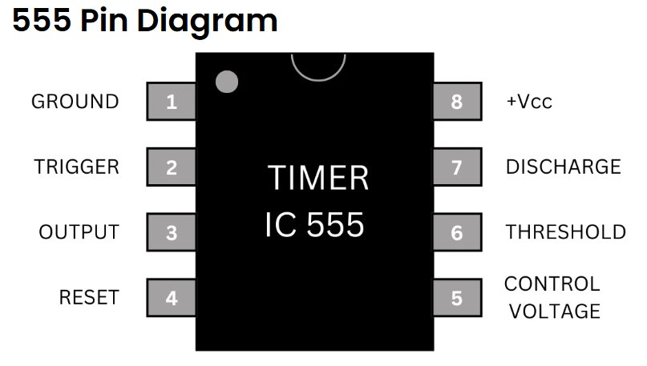
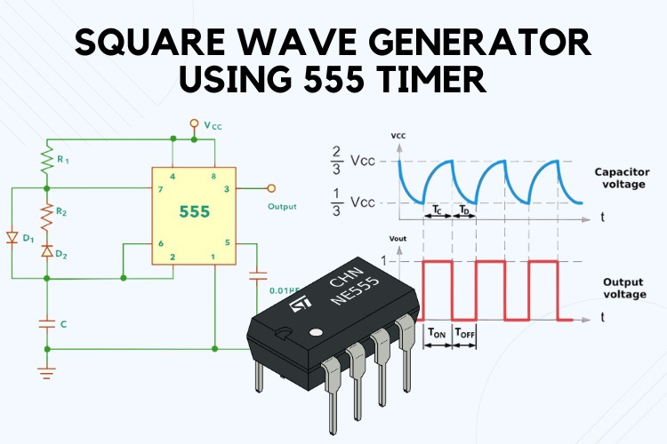

# 555 Timer Integrated Circuit (IC) Projects

Here are a few simple projects for learning about electronics, all centered around the
extremely popular 555 timer integrated circuit (IC)

## [History of the 555](./555-HISTORY.md)
## [Common 555 applications](./555-APPLICATIONS.md)

## Project 1: [Single LED Flasher](01-single-led-flasher/BUILDME.md)
## Project 2: [Dual LED Flasher](02-dual-led-flasher/BUILDME.md)
## Project 3: [Dual Variable-Frequency LED Flasher ](03-dual-led-flasher-with-potentiometer/BUILDME.md)

### 555 in "Astable" Mode: Square Wave Generator

